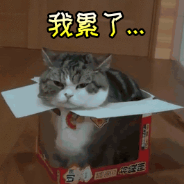

# 分治策略

# 1.交换排序问题

## 题目描述
对于一个 `1` 到 `n` 的排列，我们引入了一种新的排序方式，称为**交换排序**：  
每次操作可以选择排列中任意两个**差的绝对值恰好为 1** 的数字进行交换。  
请计算对该排列进行升序排序时，所需交换操作次数的最小值。

**说明**：1 到 n 的排列中，每个数均出现且仅出现一次。

## 输入格式
- 第一行输入一个正整数 `T`，表示数据组数。
- 对于每组数据：
  1. 第一行输入一个整数 `n`，表示排列的长度。
  2. 第二行输入 `n` 个整数，为 `1` 到 `n` 的一个排列。

**数据约束**：所有数据的 `n` 之和不大于 `1e5`。

## 输出格式
每组数据输出一行一个整数，代表最小交换次数。

## 测试样例
### 输入
```
2
3
1 3 2
5
5 3 2 1 4
```

### 输出
```
1
7
```

## 题目分析与思路分析（补充）
- 核心观察：每次只能交换相邻数字（差的绝对值为 1），因此该问题等价于计算排列的**逆序对数量**。📌
- 例如：
  - 第一组样例 `[1,3,2]` 中，逆序对为 `(3,2)`，数量为 1，故输出 1。
  - 第二组样例 `[5,3,2,1,4]` 中，逆序对数量为 7（(5,3),(5,2),(5,1),(5,4),(3,2),(3,1),(2,1)），故输出 7。
- 求解方法：需使用高效的逆序对计数算法（如归并排序、树状数组），时间复杂度为 `O(n log n)`，以满足数据规模要求。


## 代码
    #include <iostream>
    #include <vector>
    using namespace std;


    long long mergeCount(vector<int>& arr, vector<int>& temp, int left, int mid, int right) {
        int i = left;
        int j = mid + 1;
        int k = left;
        long long count = 0;
        while (i <= mid && j <= right) {
            if (arr[i] <= arr[j]) {
                temp[k++] = arr[i++];
            }else {
                temp[k++] = arr[j++];
                count +=(mid - i + 1);
            }
        }
        while (i <= mid) {
            temp[k++] = arr[i++];
        }
        while (j <= right) {
            temp[k++] = arr[j++];
        }
        for (int i = left; i <= right; i++) {
            arr[i] = temp[i];
        }
        return count;
    }


    long long  merge_sort_count(vector<int>& arr, vector<int>& temp, int left, int right) {
        long long count = 0;
        if (left < right) {
            int mid = (left + right) / 2;
            count += merge_sort_count(arr, temp, left, mid);
            count += merge_sort_count(arr, temp, mid + 1, right);
            count += mergeCount(arr, temp, left, mid, right);
        }
        return count;
    }


    int main() {
        int T;
        cin >> T;
        while (T--) {
            int n;
            cin >> n;
            vector<int> v(n);
            for(int i = 0; i < n; i++) {
                cin >> v[i];
            }
            long long count = 0;
            vector<int> temp(n);
            count = merge_sort_count(v, temp, 0, n - 1);
            cout << count << "\n";
        }
        return 0;
    }


## tip：
- 首先这一题，最重要的一点就是我们需要知道这道题目的思路。交换并且差值只能为1，我们可以在模拟的时候发现，似乎和逆序数有关联（也是一种经验的总结）
- 本题还需要注意的就是题目数据的问题，当然这种问题经常会出现，写题目的时候注意一下就行了，如果没过的话就需要注意一下是不是数据范围的问题了。
- 其次就是，就算我们知道了是逆序对的思路了，我们仍然需要注意本题的一个时间复杂度，如果只是使用两个for循环来查看有多少个逆序对的话，就会被这道题目卡掉。
- 通过分治思想，我们发现可以把这些数组全部分成一半一半的，先算内部的逆序对，然后再合并的时候来计算总的逆序对。然后我们不难发现这就是归并排序的思想，所以如果这道题目你用归并排序，记录交换次数也可以算出这道题目。


---

# 2.最大连续和
## 题目描述
给出一个数列，请寻找整数 \(i, j\)（\(1 \leq i \leq j \leq n\)），使得 \(\sum_{k=i}^{j} a_k\) 最大。

> 我求求你们了，不要用动态规划好不好

## 输入格式
本题有多组数据。
1. 第一行为整数 \(T\)，表示数据组数。
2. 对于每组数据：
   - 第一行为整数 \(n\)，代表数列的数字个数。
   - 接下来一行有 \(n\) 个整数，表示数列的元素。

**数据约束**：所有数据的 \(n\) 之和不超过 \(10^5\)，数列元素的绝对值不超过 \(10^4\)。

## 输出格式
每组数据输出一行一个整数，表示最大的 \(\sum_{k=i}^{j} a_k\)。

## 测试样例
### 输入
```
2
4
1 2 -1 10
3
-1 -2 -3
```

### 输出
```
12
-1
```

## 题目注解
> 我知道你很急着用动态规划，但是这节课讲了分治，所以你先别急.jpg

## 代码
    #include <iostream>
    #include <vector>
    #include <climits>
    #include <algorithm> // 用于max函数

    using namespace std;
    using ll = long long;
    ll maxSum(const vector<ll>& nums, ll left, ll right, ll mid) {
        ll leftSum = LONG_LONG_MIN;
        ll currentSum = 0;
        for (ll i = mid; i >= left; i--) {
            currentSum += nums[i];
            if (currentSum > leftSum) {
                leftSum = currentSum;
            }
        }
        ll rightSum = LONG_LONG_MIN;
        currentSum = 0;
        for(ll i = mid + 1; i <= right; i++) {
            currentSum += nums[i];
            if (currentSum > rightSum) {
                rightSum = currentSum;
            }
        }
        return leftSum + rightSum;
    }
    ll maxSumTwo(const vector<ll>& nums, ll left, ll right) {
        if(left == right) {
            return nums[left];
        }
        ll mid = left + (right - left) / 2;
        return max({
            maxSumTwo(nums, left, mid),
            maxSumTwo(nums, mid + 1, right),
            maxSum(nums, left, right, mid)
        });
    }
    int main() {
        ios::sync_with_stdio(false);
        cin.tie(nullptr);
        int T;
        cin >> T;
        while (T--) {
            int n;
            cin >> n;
            vector<ll> v(n);
            for (int i = 0; i < n; i++) {
                cin >> v[i];
            }
            cout << maxSumTwo(v,0,n-1) << "\n";
        }
        return 0;
    }

## 代码思路：
# 分治算法解决最大子数组问题

## 算法解释

分治算法解决最大子数组问题的核心思路是将问题分解为三个子问题：

1. **左半部分的最大子数组和**：递归处理数组左半部分
2. **右半部分的最大子数组和**：递归处理数组右半部分
3. **跨越中间点的最大子数组和**：这是合并步骤的关键，需要单独计算

## 关键函数解析

### maxCrossingSum 函数：
- 计算跨越中间点的最大子数组和
- 从中间点向左扩展，找到左侧最大子数组和
- 从中间点向右扩展，找到右侧最大子数组和
- 返回左右两部分的和（即跨越中间点的最大子数组和）

### maxSubarraySum 函数：
- 递归函数，实现分治逻辑
- 基本情况：当子数组只有一个元素时，返回该元素
- 递归情况：将数组分为两半，分别计算左半部分、右半部分和跨越中间的最大子数组和，返回三者中的最大值

### main 函数：
- 处理多组输入数据
- 读取每组数据并调用分治函数计算结果
- 输出每组数据的最大子数组和

## 时间复杂度分析

- 每次递归将问题规模减半，递归深度为 O(log n)
- 每层递归中，maxCrossingSum 函数需要 O(n) 时间
- 总体时间复杂度为 O(n log n)

这种分治方法虽然比动态规划的 O(n) 时间复杂度稍高，但很好地体现了分治算法 "分而治之" 的思想，适用于理解递归和分治策略的应用。

---

# 3.L形骨牌密铺问题

## 题目描述
有一块被挖去一格的 \(2^k \times 2^k\) 棋盘，其中 \(x\) 代表行编号（从1开始，从上到下），\(y\) 代表列编号（从1开始，从左到右）。请在棋盘上放置L形的骨牌，使得骨牌不互相重叠且整个骨牌均在棋盘的非空缺位置上，且棋盘的每个格子均有骨牌覆盖（即对缺少一格的棋盘进行密铺）。

本题中的L形骨牌特指在一块 \(2 \times 2\) 的骨牌上任意挖去一格之后可形成的4种骨牌之一。

## 输入格式
- 第一行输入一个整数 \(T\)，表示数据组数。
- 对于每组数据，输入一行三个整数 \(k, x, y\)，含义分别为棋盘大小为 \(2^k \times 2^k\)，空缺位置为第 \(x\) 行第 \(y\) 列。
- 保证 \(1 \leq k \leq 5\)。

## 输出格式
每组数据输出一个 \(2^k \times 2^k\) 的矩阵，表示每个位置的骨牌编号：
- 骨牌编号连续且从1开始
- 空缺的位置用0进行标记

## 测试样例
### 输入
```
1
2 2 2
```

### 输出
```
3 3 1 1
3 0 2 1
4 2 2 5
4 4 5 5
```
        
## 代码
    #include <iostream>
    #include <vector>
    #include <cmath>
    using namespace std;

    int board[1024][1024];
    int Count = 0;
    //x,y是左上角，dx,dy是点坐标
    void solve(int x, int y, int dx, int dy, int size) {
        if (size == 1) {
            return;
        }
        int s = size / 2;
        int currentCount = ++Count;


        if (dx < x + s && dy < y + s) {
            solve(x, y, dx, dy, s);
            board[x + s - 1][y + s] = currentCount;
            board[x + s][y + s - 1] = currentCount;
            board[x + s][y + s] = currentCount;//这个地方先填写当前递归的内容
            solve(x, y + s, x + s - 1, y + s, s); // 递归处理右上象限
            solve(x + s, y, x + s, y + s - 1, s); // 递归处理左下象限
            solve(x + s, y + s, x + s, y + s, s); // 递归处理右下象限
        }
        // 右上
        else if (dx < x + s && dy >= y + s) {
            solve(x, y + s, dx, dy, s);
            board[x + s - 1][y + s - 1] = currentCount;
            board[x + s][y + s - 1] = currentCount;
            board[x + s][y + s] = currentCount;
            solve(x, y, x + s - 1, y + s - 1, s);
            solve(x + s, y, x + s, y + s - 1, s);
            solve(x + s, y + s, x + s, y + s, s);
        }
        // 左下
        else if (dx >= x + s && dy < y + s) {
            solve(x + s, y, dx, dy, s);
            board[x + s - 1][y + s - 1] = currentCount;
            board[x + s - 1][y + s] = currentCount;
            board[x + s][y + s] = currentCount;
            solve(x, y, x + s - 1, y + s - 1, s);
            solve(x, y + s, x + s - 1, y + s, s);
            solve(x + s, y + s, x + s, y + s, s);
        }
        // 右下
        else {
            solve(x + s, y + s, dx, dy, s);
            board[x + s - 1][y + s - 1] = currentCount;
            board[x + s - 1][y + s] = currentCount;
            board[x + s][y + s - 1] = currentCount;
            solve(x, y, x + s - 1, y + s - 1, s);
            solve(x, y + s, x + s - 1, y + s, s);
            solve(x + s, y, x + s, y + s - 1, s);
        }
    }

    int main() {
        ios::sync_with_stdio(false);
        cin.tie(nullptr);
        int t;
        cin >> t;
        while (t--) {
            int k, x, y;
            cin >> k >> x >> y;
            int n = pow(2, k);

            board[x-1][y-1] = 0;
            Count = 0;
            solve(0, 0, x-1, y-1, n);
            for (int i = 0; i < n; ++i) {
                for (int j = 0; j < n; ++j) {
                    cout << board[i][j] << " ";
                }
                cout << "\n";
            }
        }
        return 0;
    }

## 代码思路
- 首先这道题目关键点就在于怎么使用分治去解决，其实我们写到第三题，不难发现所谓分治，就是先分，再递归。递归才是关键，这道题是否能写出来，主要取决于这个递归函数你是否会写。
- 其次就是，本题目中是否可以观察到，不断地将这个正方形进行切割，就可以出先新的四个正方形，然后再人工制造三个缺口，这样形成的四个正方形就一模一样了。


# 4.最小半径切轴覆盖圆问题

## 题目描述
在平面直角坐标系上给定 \(n\) 个点，请寻找一个半径最小且与 \(x\) 轴相切的圆，使得这个圆可以包含所有点且与 \(x\) 轴相切。保证点均不在 \(x\) 轴上。如果不存在这样的圆，请输出 \(-1\)。

## 输入格式
1.  第一行输入一个整数 \(n\)，代表点的个数。
2.  接下来的 \(n\) 行，每行输入两个整数 \(x_i, y_i\)，代表第 \(i\) 个点的横纵坐标。

**保证**：点的数量不大于 \(100\)，点坐标的绝对值不大于 \(10^4\) 且纵坐标不为 \(0\)。

## 输出格式
一个数，表示最小的圆的半径；如果圆不存在，输出 \(-1\)。你的答案将会被认为正确当且仅当你的答案和评测机的答案的差的绝对值不超过 \(10^{-6}\)。

## 测试样例

### 样例输入 1
```
1
0 1
```

### 样例输出 1
```
0.5
```

### 样例输入 2
```
3
0 1
0 2
0 -3
```

### 样例输出 2
```
-1
```

### 样例输入 3
```
2
0 1
1 1
```

### 样例输出 3
```
0.625
```

## 题目注解
这个莫名其妙的标题包含了本题的两种做法。本题较为正常的实现用时应该在 800ms 以下，很精良的算法实现时间应该在 200ms 以下，并未卡常。

请注意，直接输入 double 同样非常慢，应该予以避免。

如果遇到精度不足的情况，可以使用 long double 解决问题。如果遇到认为评测数据精度存在问题的情况，请联系助教。

**思考**：本题目精度要求那么低，数据也不大，为什么会炸精度呢？


## 代码
    #include <iostream>
    #include <vector>
    #include <cmath>
    #include <iomanip>

    using namespace std;
    const long double INF = 1e18;
    struct Point {
        long double x, y;
    };
    int n;
    vector<Point> points;

    bool check(long double r) { //通过数学计算得出来的，计算内容草稿纸进行
        long double h_min = -INF;
        long double h_max = INF;
        for(const auto &p : points) {
            long double x = p.x, y = p.y;
            if(y > 2.0 * r) { //前提条件，如果不满足，直接返回，降低时间复杂度
                return false;
            }
            //一元二次不等式
            long double delta = 4.0L * y * (2.0L * r - y);
            long double sqrt_delta = sqrt(delta);
            //两个h解
            long double h1 = (2.0L * x - sqrt_delta) / 2.0L;
            long double h2 = (2.0L * x + sqrt_delta) / 2.0L;
            //不断向中间逼近，小的往上去，大的往下来
            h_min = max(h_min, min(h1, h2));
            h_max = min(h_max, max(h1, h2));
        }
        //如果还有区间，证明有解，说明这个r可以存在一个圆，返回true
        return h_min <= h_max;
    }
    int main() {
        ios::sync_with_stdio(false);
        cin.tie(nullptr);
        cin >> n;
        bool flag1 = true; //都是正
        bool flag2 = true; //都是负
        points.resize(n);
        for(int i = 0; i < n; i++) {
            cin >> points[i].x >> points[i].y;
            if (points[i].y > 0) {
                flag2 = false;
            }
            if (points[i].y < 0) {
                flag1 = false;
            }
        }
        if (!flag1 && !flag2) {
            cout << -1 << endl;
            return 0;
        }
        if (flag2) {
            for (int i = 0; i < n; ++i) {
                points[i].y = -points[i].y;
            }
        }
        long double low = 0, high = INF;
        for (int i = 0; i < 100; ++i) {
            long double mid = (low + high) / 2.0;
            if (check(mid)) {
                high = mid;
            } else {
                low = mid;
            }
        }
        if (high >= INF - 1.0) {
            cout << -1 << endl;
        } else {
            cout << fixed << setprecision(10) << high << endl;
        }

        return 0;
    }

## 代码思路
- 首先这道题目大家第一眼看的时候，肯定会觉得毫无思路。我一开始看这道题目的时候，想到的分治思路是把所有的点按照x的大小排列，然后一半一半的分，最后两个可以直接算出圆的半径和圆心，然后合并的时候，计算出新的圆心以及半径，首先这样的算法肯定很难算，再者就是最后合并出来的半径是否就是真的对的答案。如果这个半径已经超过了x轴，那么半径应该是多少，是随意的上移吗？这显然不对
- 于是我们就想着对半径进行二分法的尝试，规定一个总的次数，然后利用相应的数学知识，一元二次不等式的知识来完成计算结果，然后检验是否成立，不断地进行二分法即可。
- 当然，这道题目，让我们发现我们需要注意一个问题，就是精度问题，当题目要求需要六位，七位的时候，最好直接写十位，保证精度的存在。
---

